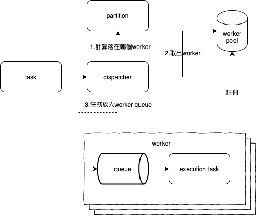

# txdis

Concurrency transaction queue

## Overview

任務分配器，控制相同id 的任務永遠給同一個`worker` 執行。

並將異步功能設計為可以用同步的方式撰寫，簡化業務邏輯的複雜度。



## Example

```go
package main

import (
	"fmt"

	"github.com/mattwangwl/txdis"
)

func main() {
	hello := txdis.NewTask(123, func() (interface{}, error) {
		return "hello", nil
	})

	world := txdis.NewTaskR(func() (interface{}, error) {
		return "world", nil
	})

	d := txdis.New(txdis.NewDefaultConfig())
	d.Delegate(world)
	d.Delegate(hello)

	fmt.Println(hello.Result())
	fmt.Println(world.Result())
}
```

## Examples of situational

### 扣庫問題

確保商品的庫存不會同時被執行加減動作，避免因為同時取得庫存數時產生的誤差。

```go
package main

import (
	"fmt"
	"time"

	"github.com/mattwangwl/txdis"
)

var appleStorage = 100
var bananaStorage = 80

func main() {
	d := txdis.New(txdis.NewDefaultConfig())

	go func() {
		for i := 0; i < 50; i++ {
			apple := txdis.NewTask(1, func() (interface{}, error) {
				appleStorage = appleStorage - 1
				return nil, nil
			})

			go d.Delegate(apple)
		}
	}()

	go func() {
		for i := 0; i < 60; i++ {
			banana := txdis.NewTask(2, func() (interface{}, error) {
				bananaStorage = bananaStorage - 1
				return nil, nil
			})

			go d.Delegate(banana)
		}
	}()

	<-time.After(5 * time.Second)
	fmt.Println("appleStorage:", appleStorage)
	fmt.Println("bananaStorage:", bananaStorage)
	// Output:
	// appleStorage: 50
	// bananaStorage: 20
}
```

### 等待結果

使用`async await`的概念，使用`Result()` 取得task 執行後的結果。

```go
package main

import (
	"fmt"
	"time"

	"github.com/mattwangwl/txdis"
)

func main() {
	d := txdis.New(txdis.NewDefaultConfig())

	task1 := txdis.NewTask(123, func() (interface{}, error) {
		for i := 0; i < 5; i++ {
			fmt.Println("task1 num:", i)
			<-time.After(100 * time.Millisecond)
		}
		fmt.Println("task1 finish")
		return "task1 result", nil
	})

	task2 := txdis.NewTask(456, func() (interface{}, error) {
		for i := 0; i < 3; i++ {
			fmt.Println("task2 num:", i)
			<-time.After(100 * time.Millisecond)
		}
		fmt.Println("task2 finish")
		return "task2 result", nil
	})

	d.Delegate(task1)
	d.Delegate(task2)

	fmt.Println(task1.Result())
	fmt.Println(task2.Result())
	// Output:
	// task2 num: 0
	// task1 num: 0
	// task2 num: 1
	// task1 num: 1
	// task1 num: 2
	// task2 num: 2
	// task2 finish
	// task1 num: 3
	// task1 num: 4
	// task1 finish
	// {task1 result <nil>}
	// {task2 result <nil>}
}
```
